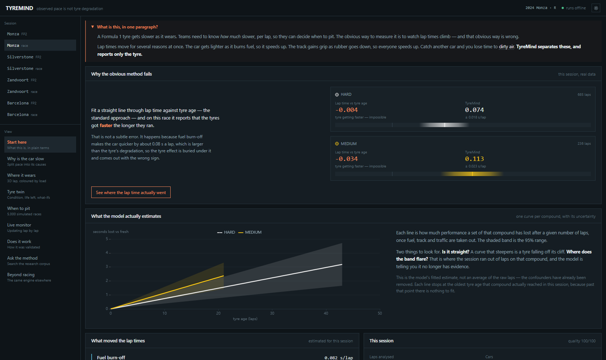
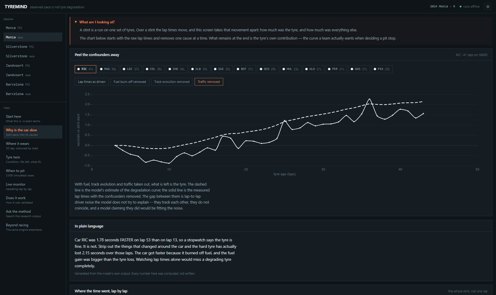
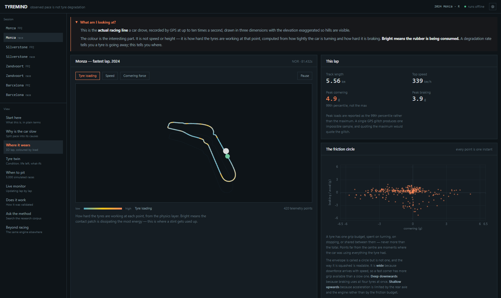
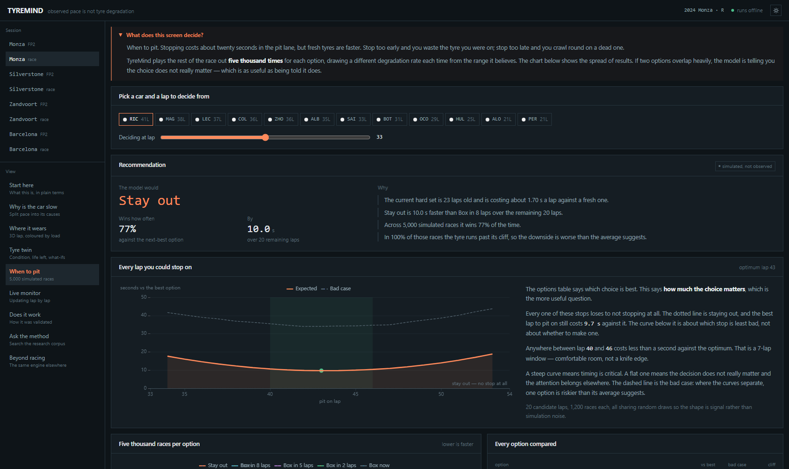

<div align="center">

# TYREMIND

### Causal Tyre Intelligence

**Observed performance is not the same thing as tyre degradation.**


```
pip install -r requirements.txt && pip install -e . && python -m tyremind.serve
```

Python 3.11+ &nbsp;·&nbsp; no Node, no network, no API key

[**Run it**](#run-it) &nbsp;·&nbsp;
[Results](#results) &nbsp;·&nbsp;
[Why this is hard](#why-this-is-hard) &nbsp;·&nbsp;
[Technical dossier (PDF)](docs/pitch/TyreMind_Technical_Dossier.pdf) &nbsp;·&nbsp;
[Pitch deck (PDF)](docs/pitch/TyreMind_Pitch_Deck.pdf)

</div>

<br>



---

## The problem, in one example

Here is a real stint from the 2024 Italian Grand Prix. Over forty laps the car
got **1.78 seconds faster**.

A stopwatch says the tyre is fine. It is not. Over those same laps the hard tyre
lost **2.15 seconds** of performance — the car got quicker because it burned off
3.27 seconds of fuel weight, and the fuel gain was larger than the tyre loss.

Read lap times alone and you miss a dying tyre completely.

That is not an edge case. Fit the standard method — a straight line through lap
time against tyre age — to a real race and it reports **negative degradation**:
tyres apparently getting faster the longer they run. It happens on every race we
tested, because fuel burn-off is worth about 0.08 s/lap and is simply bigger than
the effect being measured.

**TyreMind estimates the latent performance state of a tyre underneath that
confounded observation** — separating degradation from fuel burn-off, track
evolution and traffic, and reporting how sure it is about each.

---

## What it looks like

<table>
<tr>
<td width="50%">



**Why is the car slow** — confounders lifted off a stint one at a time. The
dashed line is the model's degradation estimate; the solid line is the measured
lap times with fuel, track and traffic removed.

</td>
<td width="50%">



**Where it wears** — the real racing line in 3D, coloured by the frictional load
the physics layer computes at each point, with the friction envelope beside it.

</td>
</tr>
<tr>
<td width="50%">



**When to pit** — five thousand simulated races per option, with the degradation
rate resampled from its posterior for every race, plus the full pit-lap sweep.

</td>
<td width="50%">

**Six more screens.** A tyre twin with per-corner condition and what-if
counterfactuals. A live monitor streaming lap by lap with no access to future
data, where the interval visibly collapses as evidence arrives. The validation
evidence. A retrieval search over the project's own research corpus. And the same
estimator pointed at NASA turbofan engines.

Dark and light themes. Every estimate drawn as an interval, never printed as a
bare number with a plus-or-minus appended.

</td>
</tr>
</table>

---

## Results

Every figure below is produced by a script in `experiments/` and read from
`experiments/results/*.json`. Nothing here is typed by hand.

### Can it recover a degradation rate it was never shown?

25 synthetic sessions with a known hidden rate, buried under realistic
confounding:

| | Naive (lap time vs tyre age) | **TyreMind** |
|---|---:|---:|
| Mean absolute error | 0.0966 s/lap | **0.0044 s/lap** |
| Bias | −0.0966 | **+0.0012** |
| 95% interval coverage | — | **100%** |

**95.5% error reduction.** The naive bias equals the fuel slope, in the direction
theory predicts — the collinearity showing up as a measured quantity.

### Does a Friday curve predict Sunday?

2024, five events, ten compound comparisons. No race data reaches the practice
fit:

| | Naive | **TyreMind** |
|---|---:|---:|
| MAE | 0.1166 s/lap | **0.0518 s/lap** |
| 95% coverage | — | 90% |

There is a **systematic +0.047 s/lap bias** — practice over-predicts race
degradation in 9 of 10 comparisons. Reported, not tuned away.

### Does the physics compute what it claims?

The pipeline goes GPS trace → curvature → lateral acceleration → per-corner load.
It is never told which way a circuit runs. A clockwise circuit must load its
*left* tyres more.

**7 of 8 circuits recovered correctly.** Clockwise circuits show 21–35% left-turn
energy; anti-clockwise 60–75%. Austin misses at 46.2% and is reported as a miss.

### Does it work on something that is not a tyre?

Public F1 data has no measured tyre wear, so motorsport cannot supply ground
truth. NASA's C-MAPSS turbofan benchmark does.

**Same estimator, no tyre-specific code:** 26.5-cycle RUL error over 40 engines,
32% predicted early. Purpose-built deep models reach 12–20 on that dataset — this
demonstrates transfer, not competitiveness.

### Where we lose

| Model | CRPS (lap time) | Coverage | Bias drift |
|---|---:|---:|---:|
| LightGBM | **0.677** | 60% | +0.340 |
| TyreMind | 0.949 | 73% | **−0.136** |

**LightGBM predicts lap times better than we do.** It also has no parameter
meaning "degradation rate", is badly overconfident, and cannot extrapolate — bias
drift measures how much a model's error grows as it forecasts further past its
training window, and TyreMind is the only model tested whose error does not grow.

---

## Why this is hard

Three causes push lap time the same way, so many wrong decompositions sum to the
same right total.

| Collinearity | Resolved by | Evidence or assumption? |
|---|---|---|
| Fuel vs degradation, within a run | Physical prior, 0.030 s/kg × 2.7 kg/lap | **Assumption** |
| Track evolution vs a uniform rate shift | Saturating basis + amplitude prior | **Assumption** |
| Tyre age vs session lap | Fitting the whole field — pit stagger | **Evidence** |

Only one of the three is resolved by data. `exp02_prior_sensitivity` measures what
the other two cost if wrong: with the fuel prior off by a full standard deviation,
error is 0.0199 s/lap — still 5× better than naive.

The second collinearity was not anticipated. It was found by chasing a −0.013
s/lap bias that survived removing the cliff, scrubbed sets and traffic from the
generator. Shift every degradation rate by *c* and the track slope by *−c*, and
the difference is constant *within a run* — exactly what the run intercept
absorbs.

---

## Scientific honesty

TyreMind does **not** measure tread depth. Public telemetry does not contain it.
It estimates a *latent performance state*.

It does **not** measure tyre temperature — the thermal model produces estimated
states, calibrated against degradation rather than any sensor.

It does **not** perform causal identification. The decomposition is exact
arithmetic on an assumed structural model, two of whose assumptions are priors.

See [`docs/model_card.md`](docs/model_card.md) and
[`docs/research/13_LIMITATIONS_AND_FAILURE_MODES.md`](docs/research/13_LIMITATIONS_AND_FAILURE_MODES.md).

---

## Run it

**Python 3.11 or newer, and nothing else.** The dashboard ships built, eight
sessions ship cached, and no step needs a network connection.

```bash
git clone https://github.com/nitya-prakash-pandey-2005/TyreMind.git
cd TyreMind

python -m venv .venv
.venv\Scripts\activate                 # Windows
# source .venv/bin/activate            # macOS / Linux

pip install -r requirements.txt        # dependencies
pip install -e .                       # the tyremind package itself

python -m tyremind.serve               # opens http://127.0.0.1:8077
```

That is the whole thing. The last command starts the API, serves the dashboard
from the same process, pre-fits the cached sessions so no click in the demo is
the slow one, and opens a browser.

> [!IMPORTANT]
> **Both install lines are needed, in that order.** `pyproject.toml` declares no
> dependency list, so `pip install -e .` installs the package but none of what it
> imports. The first line fixes the versions; the second makes `tyremind`
> importable.

Expect roughly this on startup:

```
  TYREMIND
  Causal tyre intelligence

  sessions      8 (8 cached locally)
  warming     fitting cached sessions…
              8 ready in 22.4s

  dashboard   http://127.0.0.1:8077
  api docs    http://127.0.0.1:8077/docs
```

Warming takes 10–40 s depending on the machine. Pass `--no-warm` to start in
about a second and pay the ~6 s cost on first use of each session instead.

| Flag | |
|---|---|
| `--port 9000` | Use a different port if 8077 is taken |
| `--no-browser` | Do not open a browser — for a remote or headless machine |
| `--no-warm` | Skip pre-fitting |
| `--host 0.0.0.0` | Serve to other machines on the network |

**Where to start once it is open.** The left rail is ordered as an argument, so
reading top to bottom works. **Start here** shows why the obvious method fails on
this session's real numbers; **Live monitor** is the one to press play on,
because it shows the estimator running forward-only, one lap at a time, with the
interval visibly collapsing as evidence arrives. Every view is deep-linkable —
`#/circuit`, `#/strategy`, and so on.

**Verify the install:**

```bash
pytest              # 97 tests, about 19 s
ruff check .        # lint
```

If those pass, everything in this README is reproducible on your machine.

---

<details>
<summary><b>Optional extras</b> — MCP server, LLM narration, more sessions, frontend development</summary>

<br>

None of these are needed to run the dashboard.

### The MCP server — the estimator as tools an AI assistant can call

```bash
pip install -r requirements-optional.txt

python -m tyremind.mcp_server           # stdio, for Claude Desktop
python -m tyremind.mcp_server --http    # streamable HTTP
```

For Claude Desktop, add to `claude_desktop_config.json`:

```json
{
  "mcpServers": {
    "tyremind": {
      "command": "python",
      "args": ["-m", "tyremind.mcp_server"],
      "cwd": "/absolute/path/to/TyreMind"
    }
  }
}
```

Seven read-only tools: `list_sessions`, `get_degradation`, `explain_lap`,
`project_tyre_life`, `recommend_strategy`, `assess_trust`, `search_documentation`.

### LLM narration

Entirely optional. Without a key, TyreMind narrates from deterministic templates
with every number computed before the text is written — which is the safer
default, not a fallback.

```bash
cp .env.example .env                    # then paste your key into .env
```

`.env` is gitignored. Never commit a key.

### Caching more sessions

Eight sessions are committed as Parquet, so a fresh clone runs offline. To add
more you need network access once:

```bash
python scripts/build_demo.py --events Monza Suzuka --year 2024
python scripts/build_track_geometry.py --circuits Suzuka   # for the 3D view
```

### Working on the frontend

The dashboard is committed pre-built, so this is only needed if you change it.
Requires Node 20 or newer.

```bash
cd apps/web
npm install
npm run dev                             # hot reload on :5173, proxies the API
npm run build                           # rebuild dist/ — commit the result
```

</details>

<details>
<summary><b>Reproducing every number</b> — the seven experiment scripts</summary>

<br>

Every figure in the interface, the model card and the pitch documents is read
from a JSON file under `experiments/results/`. Regenerating those files
regenerates the claims.

```bash
python experiments/exp01_ground_truth_recovery.py --n-seeds 25   # ~4 min
python experiments/exp02_prior_sensitivity.py                    # ~6 min
python experiments/exp03_practice_to_race.py --year 2024         # ~3 min
python experiments/exp04_energy_clock.py
python experiments/exp05_model_ladder.py                         # ~8 min
python experiments/exp06_circuit_asymmetry.py
python experiments/exp07_cross_domain.py --subset FD001          # ~3 min
```

`exp03`, `exp06` and `exp07` download data on first run and are cached
afterwards. The rest are fully offline.

</details>

<details>
<summary><b>If something goes wrong</b></summary>

<br>

| Symptom | Cause and fix |
|---|---|
| `ModuleNotFoundError: No module named 'tyremind'` | `pip install -e .` was skipped, or the virtualenv is not active |
| `ModuleNotFoundError: No module named 'fastf1'` (or numpy, pandas…) | `pip install -r requirements.txt` was skipped — `pip install -e .` alone installs no dependencies |
| `Dashboard not built. The API will run without it.` | `apps/web/dist/` is missing. It is committed, so this means a partial clone — or run `npm --prefix apps/web run build` |
| `[Errno 10048] address already in use` | Something else holds port 8077. Use `--port 9000` |
| `No sessions are cached` | `data/demo/` is missing. It is committed; with network access, `python scripts/build_demo.py` rebuilds it |
| Charts render but are blank or monochrome | A stale build. `npm --prefix apps/web run build`, then hard-reload the browser |
| Slow first click on a session | Expected with `--no-warm`. A session fit takes about 6 s and is then cached for the process lifetime |

</details>

---

## Structure

```
src/tyremind/
  data/          FastF1 ingestion, quality engine, synthetic ground truth
  models/ssm/    Kalman kernel and the tyre state-space model
  models/        baselines, evaluation harness, trust layer, validation
  physics/       dynamics, thermal, wear
  causal/        decomposition, counterfactuals, projection
  simulate/      Monte Carlo race and strategy
  assets/        AssetProfile abstraction, C-MAPSS adapter
  stream/        online estimator and replay
  explain/       narration templates, business value
  rag/           hybrid retrieval index over the project's own documents
  api/           FastAPI service
  mcp_server.py  seven read-only tools for an AI agent

apps/web/        React dashboard — src/ plus a committed dist/, so a clone
                 runs without Node
data/demo/       eight sessions as Parquet, plus circuit geometry, committed
experiments/     reproducible scripts; results/ holds the JSON the UI reads
docs/            research audit, model card, limitations, demo guide
docs/pitch/      technical dossier and pitch deck, with their HTML sources
scripts/         cache builders, run once with network access
```

---

## Documentation

| | |
|---|---|
| [Research audit](docs/research/01_RESEARCH_AUDIT.md) | Prior art, feasibility, what was cut and why |
| [Data availability](docs/research/03_DATA_AVAILABILITY.md) | What public F1 data does and does not contain |
| [Physics foundation](docs/research/04_PHYSICS_FOUNDATION.md) | Dynamics, thermal, wear — and their validation |
| [Statistical architecture](docs/research/05_STATISTICAL_ARCHITECTURE.md) | The model, and why a Kalman filter |
| [Novelty analysis](docs/research/08_NOVELTY_ANALYSIS.md) | What is ours, what is not |
| [Limitations](docs/research/13_LIMITATIONS_AND_FAILURE_MODES.md) | Where it is wrong |
| [Model card](docs/model_card.md) | Intended use, assumptions, performance |
| [Demo guide](docs/DEMO_STORY.md) | Seven-minute run-through |
| [Judge questions](docs/JUDGE_QUESTIONS.md) | Anticipated questions, honest answers |
| [Integrations](docs/INTEGRATIONS.md) | MCP and RAG — what each is for, and its limits |

### Presentation material

| | |
|---|---|
| [**Technical dossier**](docs/pitch/TyreMind_Technical_Dossier.pdf) — PDF, 36pp | Problem, prior art, the identifiability derivation, model, physics, architecture, all seven experiments, uniqueness matrix, limitations, industry impact, scaling, roadmap, references |
| [**Pitch deck**](docs/pitch/TyreMind_Pitch_Deck.pdf) — PDF, 24 slides | The same argument at presentation pace |
| [`docs/pitch/deck_web.html`](docs/pitch/deck_web.html) | The pitch as one scrolling page, for sharing a link rather than a file |

Both PDFs are generated from the HTML sources beside them, so they are
regenerated rather than edited:

```bash
chrome --headless --no-pdf-header-footer \
  --print-to-pdf=docs/pitch/TyreMind_Technical_Dossier.pdf \
  docs/pitch/dossier.html
```

---

## Licence

MIT
